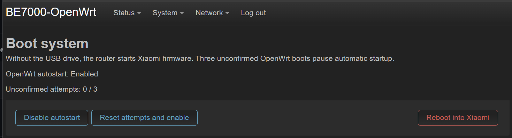

# BE7000-OpenWrt

**English** · [Русский](README.ru.md)

**OpenWrt 25.12.5 for Xiaomi BE7000 (IPQ9574)** with Linux 5.4.164 built from QSDK sources. It runs from a USB drive using **kexec**. Xiaomi firmware stays installed on the router.


## Included

- Wi-Fi 2.4/5 GHz, network scanning and LuCI management.
- LuCI in English, Russian and Simplified Chinese.
- Ethernet, USB, persistent settings, swap, all four CPU cores and LEDs.
- firewall4/nftables, NFQUEUE, TPROXY, SYNPROXY, ipset and additional netfilter modules.
- `dnsmasq-full`: DNSSEC, nftset/ipset and conntrack.
- TUN/TAP, IPv4/IPv6 policy routing and socket diagnostics.
- fq, BBR/BBR2 and AmneziaWG2.
- ECM/PPE, SFE and EIP197 acceleration modules.
- Bridge/VLAN/PPPoE/LAG, tunnel, NSS-lite/CAPWAP and OVS modules.
- Additional NFS/CIFS, WireGuard, IPsec and tunnel modules.

## Install

You need root SSH access and an **ext4 USB drive with at least 1.25 GiB free**, plus space for swap if you want it. The drive must be connected to the router and mounted by Xiaomi. The installer automatically recognizes these Xiaomi kernels:

| Xiaomi firmware | Linux 5.4.164 build |
| --- | --- |
| 1.1.16 | 22 January 2024 |
| 1.1.38 | 27 January 2026 |

- **Windows:** extract the ZIP and run `BE7000-OpenWrt-Setup.exe`. Keep the image `.tar.gz` next to the EXE. No Python installation needed.
- **Linux:** extract the archive and run the command below. You need Python 3.12+, `python3-venv` and Internet access to install dependencies.

```sh
./install.sh --bundle ./BE7000-OpenWrt-1.0.2.tar.gz
```

OpenWrt files and settings live in `/BE7000-OpenWrt` on the USB drive. Leave it connected while OpenWrt is running.

| Parameter | Action |
| --- | --- |
| `--boot-existing` | Boot OpenWrt with saved settings |
| `--action prepare` | Set up the USB drive without booting OpenWrt |
| `--action load` | Load the kernel into RAM without switching to it |
| `--preflight-only` | Check compatibility and exit |
| `--action autostart` | Enable autostart and boot OpenWrt now |

## Boot system

**LuCI → System → Boot system** has the autostart controls and a button to reboot into Xiaomi. You can also boot Xiaomi by unplugging the USB drive before powering on the router.

If OpenWrt fails to confirm a successful boot three times, autostart stops. Click “Reset attempts and enable” to try again.



<details>
<summary>Autostart flags</summary>

Files in `/BE7000-OpenWrt/boot/` on USB:

| File | Action |
| --- | --- |
| `installed` | Marks that autostart has been installed |
| `autostart-disabled` | Disables autostart; takes priority over `xiaomi-once` |
| `xiaomi-once` | Skips one OpenWrt boot, then is deleted |
| `boot-pending` | Counts unconfirmed attempts. Autostart stops at `3`; a successful boot deletes the file |

The loader waits for Xiaomi and the USB drive to be ready, with a 120-second limit for each. It then waits 10 seconds before starting OpenWrt. Another attempt requires a router reboot.

A boot is confirmed once LAN and management services have been up for 30 seconds. Internet and Wi-Fi are not needed. `be7000-boot enable` and `be7000-boot retry` clear the counter and skip flags.

</details>

## Update

Open **LuCI → System → Backup / Flash Firmware** and select `BE7000-OpenWrt-1.0.2-sysupgrade.bin`.

You can keep or reset your settings. You'll need to reinstall any packages you added yourself. The storage size, calibration, Wi-Fi files and swap are kept either way.

Updates need room for a second system and userdata image, plus 512 MiB of free space. Older installations without a `slots` directory need a fresh install.

With autostart enabled, the router returns to OpenWrt on its own. Otherwise, boot OpenWrt with the installer's `--boot-existing` option.

## Kernel modules

```sh
apk add kmod-nft-tproxy kmod-tun kmod-fs-cifs kmod-fs-nfs-v4 kmod-wireguard
```

<details>
<summary>Available modules</summary>

**Firewall / netfilter**

`kmod-arptables`,
`kmod-br-netfilter`,
`kmod-ebtables`,
`kmod-ebtables-ipv4`,
`kmod-ebtables-ipv6`,
`kmod-ebtables-watchers`,
`kmod-ip6tables`,
`kmod-ip6tables-extra`,
`kmod-ipt-checksum`,
`kmod-ipt-cluster`,
`kmod-ipt-conntrack`,
`kmod-ipt-conntrack-extra`,
`kmod-ipt-conntrack-label`,
`kmod-ipt-core`,
`kmod-ipt-debug`,
`kmod-ipt-extra`,
`kmod-ipt-filter`,
`kmod-ipt-hashlimit`,
`kmod-ipt-ipopt`,
`kmod-ipt-iprange`,
`kmod-ipt-ipsec`,
`kmod-ipt-ipset`,
`kmod-ipt-led`,
`kmod-ipt-nat`,
`kmod-ipt-nat-extra`,
`kmod-ipt-nat6`,
`kmod-ipt-nflog`,
`kmod-ipt-nfqueue`,
`kmod-ipt-offload`,
`kmod-ipt-physdev`,
`kmod-ipt-raw`,
`kmod-ipt-raw6`,
`kmod-ipt-rpfilter`,
`kmod-ipt-socket`,
`kmod-ipt-tee`,
`kmod-ipt-tproxy`,
`kmod-ipt-u32`,
`kmod-nf-conncount`,
`kmod-nf-conntrack`,
`kmod-nf-conntrack-netlink`,
`kmod-nf-conntrack6`,
`kmod-nf-dup-inet`,
`kmod-nf-flow`,
`kmod-nf-ipt`,
`kmod-nf-ipt6`,
`kmod-nf-ipvs`,
`kmod-nf-ipvs-ftp`,
`kmod-nf-ipvs-sip`,
`kmod-nf-log`,
`kmod-nf-log6`,
`kmod-nf-nat`,
`kmod-nf-nat6`,
`kmod-nf-nathelper`,
`kmod-nf-nathelper-amanda`,
`kmod-nf-nathelper-broadcast`,
`kmod-nf-nathelper-extra`,
`kmod-nf-nathelper-h323`,
`kmod-nf-nathelper-irc`,
`kmod-nf-nathelper-netbios`,
`kmod-nf-nathelper-pptp`,
`kmod-nf-nathelper-sane`,
`kmod-nf-nathelper-sip`,
`kmod-nf-nathelper-snmp`,
`kmod-nf-nathelper-tftp`,
`kmod-nf-reject`,
`kmod-nf-reject6`,
`kmod-nf-socket`,
`kmod-nf-tproxy`,
`kmod-nfnetlink`,
`kmod-nfnetlink-cthelper`,
`kmod-nfnetlink-log`,
`kmod-nfnetlink-queue`,
`kmod-nft-arp`,
`kmod-nft-bridge`,
`kmod-nft-compat`,
`kmod-nft-connlimit`,
`kmod-nft-core`,
`kmod-nft-dup-inet`,
`kmod-nft-fib`,
`kmod-nft-nat`,
`kmod-nft-netdev`,
`kmod-nft-offload`,
`kmod-nft-queue`,
`kmod-nft-socket`,
`kmod-nft-tproxy`,
`kmod-nft-xfrm`.

**VPN and tunnels**

`kmod-amneziawg`,
`kmod-gre`,
`kmod-gre6`,
`kmod-ip-vti`,
`kmod-ip6-tunnel`,
`kmod-ip6-vti`,
`kmod-ipip`,
`kmod-ipsec`,
`kmod-ipsec4`,
`kmod-ipsec6`,
`kmod-iptunnel`,
`kmod-iptunnel4`,
`kmod-iptunnel6`,
`kmod-l2tp`,
`kmod-l2tp-eth`,
`kmod-l2tp-ip`,
`kmod-mppe`,
`kmod-ppp`,
`kmod-ppp-synctty`,
`kmod-pppoe`,
`kmod-pppol2tp`,
`kmod-pppox`,
`kmod-pptp`,
`kmod-sit`,
`kmod-slhc`,
`kmod-tun`,
`kmod-udptunnel4`,
`kmod-udptunnel6`,
`kmod-wireguard`,
`kmod-xfrm-interface`.

**Network filesystems and encodings**

`kmod-asn1-decoder`,
`kmod-dnsresolver`,
`kmod-fs-cifs`,
`kmod-fs-exportfs`,
`kmod-fs-nfs`,
`kmod-fs-nfs-common`,
`kmod-fs-nfs-common-rpcsec`,
`kmod-fs-nfs-v3`,
`kmod-fs-nfs-v4`,
`kmod-fs-nfsd`,
`kmod-nls-base`,
`kmod-nls-cp437`,
`kmod-nls-iso8859-1`,
`kmod-nls-utf8`,
`kmod-oid-registry`.

**Cryptography**

`kmod-crypto-acompress`,
`kmod-crypto-aead`,
`kmod-crypto-arc4`,
`kmod-crypto-authenc`,
`kmod-crypto-cbc`,
`kmod-crypto-ccm`,
`kmod-crypto-chacha20poly1305`,
`kmod-crypto-cmac`,
`kmod-crypto-crc32c`,
`kmod-crypto-ctr`,
`kmod-crypto-cts`,
`kmod-crypto-deflate`,
`kmod-crypto-des`,
`kmod-crypto-ecb`,
`kmod-crypto-echainiv`,
`kmod-crypto-gcm`,
`kmod-crypto-geniv`,
`kmod-crypto-gf128`,
`kmod-crypto-ghash`,
`kmod-crypto-hash`,
`kmod-crypto-hmac`,
`kmod-crypto-manager`,
`kmod-crypto-md4`,
`kmod-crypto-md5`,
`kmod-crypto-null`,
`kmod-crypto-rng`,
`kmod-crypto-seqiv`,
`kmod-crypto-sha1`,
`kmod-crypto-sha256`,
`kmod-crypto-sha3`,
`kmod-crypto-sha512`,
`kmod-crypto-user`.

**Platform and Wi-Fi (preinstalled)**

`kmod-be7000-platform`,
`kmod-cfg80211`.

**Supporting modules**

`kmod-inet-diag`,
`kmod-lib-crc-ccitt`,
`kmod-lib-crc32c`,
`kmod-lib-textsearch`,
`kmod-lib-zlib-deflate`,
`kmod-lib-zlib-inflate`,
`kmod-unix-diag`.

</details>

Open an [issue](https://github.com/Quarx2k/OpenWRT-BE7000/issues) to request another module.

## Build

Build on Ubuntu 24.04 x86_64, either natively or in WSL. Keep the project on the Linux filesystem. `build.sh` downloads the sources and builds without root privileges.

```sh
sudo apt-get install build-essential git python3 python3-venv bc bison flex libssl-dev libelf-dev libncurses-dev device-tree-compiler e2fsprogs fakeroot xz-utils zstd unzip rsync gawk gettext wget file gcc-aarch64-linux-gnu qemu-user-static kmod openssl
git clone https://github.com/Quarx2k/OpenWRT-BE7000.git
cd OpenWRT-BE7000
./build.sh -j "$(nproc)"
```

Sources, build files and output are stored in `build/` inside the project. Use `--work /path/to/build` to choose another directory.

| File | Purpose |
| --- | --- |
| `BE7000-OpenWrt-1.0.2.tar.gz` | Image for the installer |
| `BE7000-OpenWrt-1.0.2-sysupgrade.bin` | Update through LuCI |
| `BE7000-runtime-1.0.2.tar.gz` | Prebuilt components for reuse with `--runtime-kit` |

Windows installer build (Python 3.12):

```powershell
py -3.12 -m venv .build-venv
.build-venv\Scripts\python.exe -m pip install -r installer\requirements.txt pyinstaller==6.16.0
.build-venv\Scripts\python.exe -m PyInstaller --onefile --console --name BE7000-OpenWrt-Setup --add-data "installer/preflight.sh;." --add-data "installer/autostart.sh;." --add-data "installer/autostart-hook.sh;." installer/install.py
```

## Sources and licenses

`main` contains scripts, configs and [patches](patches). Kernel branches and revisions are listed in [kernel-source.txt](kernel-source.txt).

| Component | Base |
| --- | --- |
| Kernel and kexec module | QSDK 12.1.r5 |
| OpenWrt | 25.12.5, armsr/armv8, built from source |
| Wi-Fi | **cfg80211 is built from source. The installer copies the other 12 vendor modules from the router** |
| Ethernet / networking | SSDK, PPE/ECM, DP, SFE, NSS-lite, EIP197, tunnel managers, NAT46, OVS, nftables and AmneziaWG built from source |
| Radio and accelerator firmware | Copied from the router by the installer, together with calibration |
| BBR2 | Google BBR `v2alpha-2020-09-10` |

Component versions: [sources.lock.json](sources.lock.json).

[GPL-2.0-or-later](LICENSE); individual component licenses apply. Qualcomm/Xiaomi binary components retain their original licenses.

The loader is based on **[kexec-mod](https://github.com/fabianishere/kexec-mod)** by **Fabian Mastenbroek**, adapted for BE7000.

[QSDK](https://git.codelinaro.org/clo/qsdk/oss/kernel/linux-ipq-5.4.git) · [OpenWrt](https://downloads.openwrt.org/releases/25.12.5/) · [iwinfo](https://git.openwrt.org/project/iwinfo.git) · [BBR2](https://github.com/google/bbr/tree/v2alpha-2020-09-10)

## Plans

- Move to Linux 6.6 or newer.
- Switch WLAN to an open-source driver stack.

## Support the project

| Currency | Network | Address |
| --- | --- | --- |
|  Bitcoin (BTC) |  Bitcoin | `bc1qs7lpzg9f592k224uvh4qr5np2kn5s46wvg063n` |
|  Ethereum (ETH) |  Ethereum | `0x1Df32aB802A57E62BA0647FbCce90C7D66Fc0e53` |
|  USDT |  TON | `UQAy362dLRWtsS5a4cRdKT8CRFprJn8VwOrGtZDZF36KF2ME` |
|  USDT |  Ethereum | `0x1Df32aB802A57E62BA0647FbCce90C7D66Fc0e53` |
|  Gram (Toncoin) |  TON | `UQAy362dLRWtsS5a4cRdKT8CRFprJn8VwOrGtZDZF36KF2ME` |
