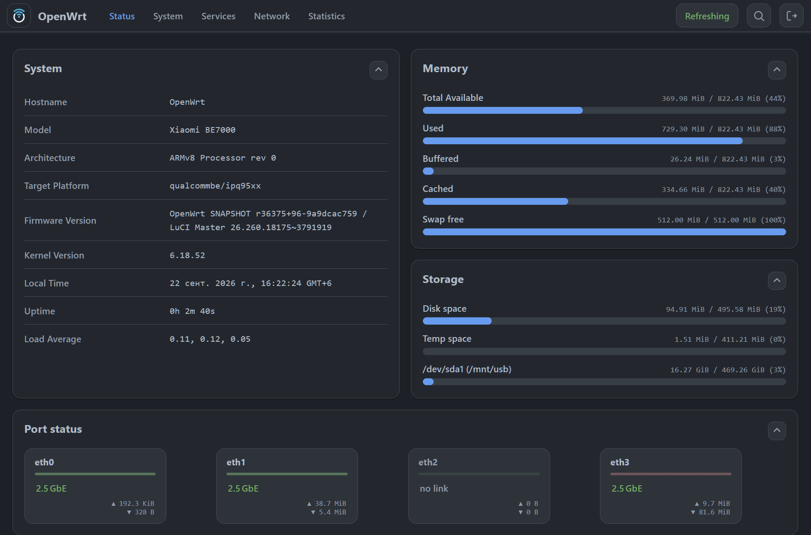

# BE7000-OpenWrt

**English** · [Русский](README.ru.md)

OpenWrt **SNAPSHOT r36754+92-c1b3943aa3** for Xiaomi BE7000, based on **Linux 6.18.54**. USB (using **kexec**) and internal NAND versions are available. All hardware features of the device are supported; factory reset using the Reset button is currently available in the NAND version.

Hardware acceleration (PPE offload) is supported for **PPPoE and Ethernet**.



**[Download releases](https://github.com/Quarx2k/OpenWRT-BE7000/releases)** — Windows and Linux installers.

## Updating

Online updates from the server are available through **LuCI → System → Attended Sysupgrade**.

To preserve your scripts and other files during an update, add their paths to `/etc/sysupgrade.conf`.

## Additional package repository

```sh
mkdir -p /etc/apk/keys /etc/apk/repositories.d
wget -O /etc/apk/keys/be7000-packages.pem \
  https://openwrt.quarx2k.dev/packages/keys/be7000-packages.pem
. /etc/openwrt_release
printf 'https://openwrt.quarx2k.dev/packages/%s/qualcommbe/ipq95xx/packages.adb\n' \
  "$DISTRIB_REVISION" > /etc/apk/repositories.d/be7000.list
apk update
```

<details>
<summary>Available packages</summary>

- **AmneziaWG** ([Slava-Shchipunov](https://github.com/Slava-Shchipunov/awg-openwrt)): `kmod-amneziawg`, `amneziawg-tools`, `luci-proto-amneziawg`, `luci-i18n-amneziawg-ru`.
- **SSClash** ([zerolabnet](https://github.com/zerolabnet/SSClash)): `luci-app-ssclash`.

</details>

## Building from source

Use Linux or WSL2 with the OpenWrt build dependencies installed. The example builds the USB version; for NAND, replace `config.be7000-usb` with `config.be7000-nand`.

```bash
git clone --branch be7000-snapshot --single-branch \
  https://github.com/Quarx2k/OpenWRT-BE7000.git
cd OpenWRT-BE7000

./scripts/feeds update -a
./scripts/feeds install -a
bash package/utils/luci-app-be7000-wifi/prepare-luci.sh .

cp config.be7000-usb .config
make defconfig
make download -j8
make -j"$(nproc)"
```

Images, sysupgrade files, and Windows/Linux installers are written to `bin/targets/qualcommbe/ipq95xx/`.

## Support the project

| Currency | Network | Address |
| --- | --- | --- |
|  Bitcoin (BTC) |  Bitcoin | `bc1qs7lpzg9f592k224uvh4qr5np2kn5s46wvg063n` |
|  Ethereum (ETH) |  Ethereum | `0x1Df32aB802A57E62BA0647FbCce90C7D66Fc0e53` |
|  USDT |  TON | `UQAy362dLRWtsS5a4cRdKT8CRFprJn8VwOrGtZDZF36KF2ME` |
|  USDT |  Ethereum | `0x1Df32aB802A57E62BA0647FbCce90C7D66Fc0e53` |
|  Gram (Toncoin) |  TON | `UQAy362dLRWtsS5a4cRdKT8CRFprJn8VwOrGtZDZF36KF2ME` |
