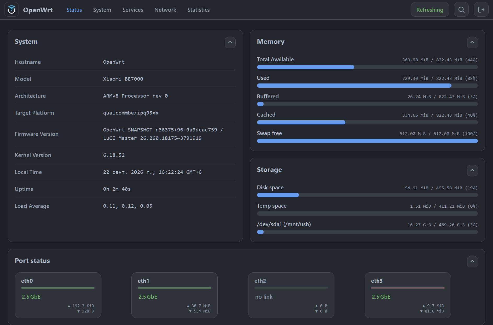
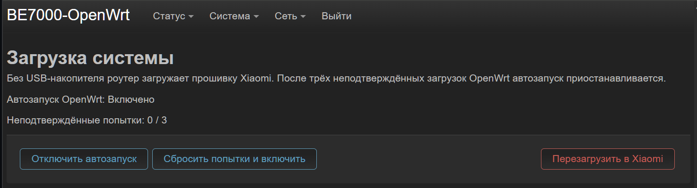

# BE7000-OpenWrt

[English](README.md) · **Русский**

**OpenWrt 25.12.5 для Xiaomi BE7000 (IPQ9574)** на ядре Linux 5.4.164 из исходников QSDK. Работает с флешки и запускается через **kexec**. Прошивка Xiaomi остаётся на роутере.



## В составе

- Wi-Fi 2,4/5 ГГц, сканирование сетей и управление через LuCI.
- LuCI на английском, русском и упрощённом китайском.
- Ethernet, USB, сохранение настроек, swap, все четыре ядра CPU и светодиоды.
- firewall4/nftables, NFQUEUE, TPROXY, SYNPROXY, ipset и дополнительные модули netfilter.
- `dnsmasq-full`: DNSSEC, nftset/ipset и conntrack.
- TUN/TAP, policy routing IPv4/IPv6 и диагностика сокетов.
- fq, BBR/BBR2 и AmneziaWG2.
- Модули ускорения ECM/PPE, SFE и EIP197.
- Модули bridge/VLAN/PPPoE/LAG, туннелей, NSS-lite/CAPWAP и OVS.
- Дополнительные модули NFS/CIFS, WireGuard, IPsec и туннелей.

## Установка

Нужны root-доступ по SSH и **флешка ext4 с минимум 1,25 ГиБ свободного места**, подключённая к роутеру и смонтированная в Xiaomi. Для swap потребуется дополнительное место. Установщик автоматически распознаёт эти ядра Xiaomi:

| Прошивка Xiaomi | Сборка Linux 5.4.164 |
| --- | --- |
| 1.1.16 | 22 января 2024 |
| 1.1.38 | 27 января 2026 |

- **Windows:** распакуйте ZIP и запустите `BE7000-OpenWrt-Setup.exe`. Оставьте архив образа `.tar.gz` рядом с EXE. Python не нужен.
- **Linux:** распакуйте архив и запустите команду ниже. Нужны Python 3.12+, `python3-venv` и интернет для установки зависимостей.

```sh
./install.sh --bundle ./BE7000-OpenWrt-1.0.2.tar.gz
```

Файлы OpenWrt и настройки лежат в `/BE7000-OpenWrt` на флешке. Она должна оставаться подключённой, пока работает OpenWrt.

| Параметр | Действие |
| --- | --- |
| `--boot-existing` | Загрузить OpenWrt с сохранёнными настройками |
| `--action prepare` | Подготовить флешку, не запуская OpenWrt |
| `--action load` | Загрузить ядро в память, но пока не запускать |
| `--preflight-only` | Проверить совместимость и выйти |
| `--action autostart` | Включить автозапуск и сразу загрузить OpenWrt |

## Загрузка системы

Автозапуск и кнопка возврата в Xiaomi находятся в **LuCI → Система → Загрузка системы**. Чтобы загрузить Xiaomi, можно просто отключить флешку перед включением роутера.

Если OpenWrt трижды не подтвердит успешную загрузку, автозапуск остановится. Для новой попытки нажмите «Сбросить попытки и включить».



<details>
<summary>Флаги автозапуска</summary>

Файлы в `/BE7000-OpenWrt/boot/` на флешке:

| Файл | Действие |
| --- | --- |
| `installed` | Отметка об установленном автозапуске |
| `autostart-disabled` | Отключает автозапуск; имеет приоритет над `xiaomi-once` |
| `xiaomi-once` | Пропускает один запуск OpenWrt и удаляется |
| `boot-pending` | Число неподтверждённых попыток. При `3` автозапуск останавливается. После успешной загрузки файл удаляется |

Загрузчик ждёт готовности Xiaomi и появления флешки — до 120 секунд на каждый этап. Затем делает паузу 10 секунд и запускает OpenWrt. Следующая попытка возможна после перезагрузки роутера.

Для подтверждения загрузки LAN и службы управления должны проработать 30 секунд. Интернет и Wi-Fi для этого не нужны. Команды `be7000-boot enable` и `be7000-boot retry` сбрасывают счётчик и флаги пропуска.

</details>

## Обновление

В **LuCI → Система → Резервное копирование / Прошивка** выберите файл `BE7000-OpenWrt-1.0.2-sysupgrade.bin`.

Настройки можно сохранить или сбросить. Пакеты, которые вы добавили сами, нужно будет установить заново. Размер хранилища, калибровки, файлы Wi-Fi и swap сохранятся в любом случае.

Для обновления нужно место под второй образ системы и userdata, плюс 512 МиБ свободного места. Старые установки без каталога `slots` нужно переустановить.

С включённым автозапуском роутер сам вернётся в OpenWrt. Без него загрузите OpenWrt через установщик с параметром `--boot-existing`.

## Модули ядра

```sh
apk add kmod-nft-tproxy kmod-tun kmod-fs-cifs kmod-fs-nfs-v4 kmod-wireguard
```

<details>
<summary>Доступные модули</summary>

**Firewall / netfilter**

`kmod-arptables`,
`kmod-br-netfilter`,
`kmod-ebtables`,
`kmod-ebtables-ipv4`,
`kmod-ebtables-ipv6`,
`kmod-ebtables-watchers`,
`kmod-ip6tables`,
`kmod-ip6tables-extra`,
`kmod-ipt-checksum`,
`kmod-ipt-cluster`,
`kmod-ipt-conntrack`,
`kmod-ipt-conntrack-extra`,
`kmod-ipt-conntrack-label`,
`kmod-ipt-core`,
`kmod-ipt-debug`,
`kmod-ipt-extra`,
`kmod-ipt-filter`,
`kmod-ipt-hashlimit`,
`kmod-ipt-ipopt`,
`kmod-ipt-iprange`,
`kmod-ipt-ipsec`,
`kmod-ipt-ipset`,
`kmod-ipt-led`,
`kmod-ipt-nat`,
`kmod-ipt-nat-extra`,
`kmod-ipt-nat6`,
`kmod-ipt-nflog`,
`kmod-ipt-nfqueue`,
`kmod-ipt-offload`,
`kmod-ipt-physdev`,
`kmod-ipt-raw`,
`kmod-ipt-raw6`,
`kmod-ipt-rpfilter`,
`kmod-ipt-socket`,
`kmod-ipt-tee`,
`kmod-ipt-tproxy`,
`kmod-ipt-u32`,
`kmod-nf-conncount`,
`kmod-nf-conntrack`,
`kmod-nf-conntrack-netlink`,
`kmod-nf-conntrack6`,
`kmod-nf-dup-inet`,
`kmod-nf-flow`,
`kmod-nf-ipt`,
`kmod-nf-ipt6`,
`kmod-nf-ipvs`,
`kmod-nf-ipvs-ftp`,
`kmod-nf-ipvs-sip`,
`kmod-nf-log`,
`kmod-nf-log6`,
`kmod-nf-nat`,
`kmod-nf-nat6`,
`kmod-nf-nathelper`,
`kmod-nf-nathelper-amanda`,
`kmod-nf-nathelper-broadcast`,
`kmod-nf-nathelper-extra`,
`kmod-nf-nathelper-h323`,
`kmod-nf-nathelper-irc`,
`kmod-nf-nathelper-netbios`,
`kmod-nf-nathelper-pptp`,
`kmod-nf-nathelper-sane`,
`kmod-nf-nathelper-sip`,
`kmod-nf-nathelper-snmp`,
`kmod-nf-nathelper-tftp`,
`kmod-nf-reject`,
`kmod-nf-reject6`,
`kmod-nf-socket`,
`kmod-nf-tproxy`,
`kmod-nfnetlink`,
`kmod-nfnetlink-cthelper`,
`kmod-nfnetlink-log`,
`kmod-nfnetlink-queue`,
`kmod-nft-arp`,
`kmod-nft-bridge`,
`kmod-nft-compat`,
`kmod-nft-connlimit`,
`kmod-nft-core`,
`kmod-nft-dup-inet`,
`kmod-nft-fib`,
`kmod-nft-nat`,
`kmod-nft-netdev`,
`kmod-nft-offload`,
`kmod-nft-queue`,
`kmod-nft-socket`,
`kmod-nft-tproxy`,
`kmod-nft-xfrm`.

**VPN и туннели**

`kmod-amneziawg`,
`kmod-gre`,
`kmod-gre6`,
`kmod-ip-vti`,
`kmod-ip6-tunnel`,
`kmod-ip6-vti`,
`kmod-ipip`,
`kmod-ipsec`,
`kmod-ipsec4`,
`kmod-ipsec6`,
`kmod-iptunnel`,
`kmod-iptunnel4`,
`kmod-iptunnel6`,
`kmod-l2tp`,
`kmod-l2tp-eth`,
`kmod-l2tp-ip`,
`kmod-mppe`,
`kmod-ppp`,
`kmod-ppp-synctty`,
`kmod-pppoe`,
`kmod-pppol2tp`,
`kmod-pppox`,
`kmod-pptp`,
`kmod-sit`,
`kmod-slhc`,
`kmod-tun`,
`kmod-udptunnel4`,
`kmod-udptunnel6`,
`kmod-wireguard`,
`kmod-xfrm-interface`.

**Сетевые файловые системы и кодировки**

`kmod-asn1-decoder`,
`kmod-dnsresolver`,
`kmod-fs-cifs`,
`kmod-fs-exportfs`,
`kmod-fs-nfs`,
`kmod-fs-nfs-common`,
`kmod-fs-nfs-common-rpcsec`,
`kmod-fs-nfs-v3`,
`kmod-fs-nfs-v4`,
`kmod-fs-nfsd`,
`kmod-nls-base`,
`kmod-nls-cp437`,
`kmod-nls-iso8859-1`,
`kmod-nls-utf8`,
`kmod-oid-registry`.

**Криптография**

`kmod-crypto-acompress`,
`kmod-crypto-aead`,
`kmod-crypto-arc4`,
`kmod-crypto-authenc`,
`kmod-crypto-cbc`,
`kmod-crypto-ccm`,
`kmod-crypto-chacha20poly1305`,
`kmod-crypto-cmac`,
`kmod-crypto-crc32c`,
`kmod-crypto-ctr`,
`kmod-crypto-cts`,
`kmod-crypto-deflate`,
`kmod-crypto-des`,
`kmod-crypto-ecb`,
`kmod-crypto-echainiv`,
`kmod-crypto-gcm`,
`kmod-crypto-geniv`,
`kmod-crypto-gf128`,
`kmod-crypto-ghash`,
`kmod-crypto-hash`,
`kmod-crypto-hmac`,
`kmod-crypto-manager`,
`kmod-crypto-md4`,
`kmod-crypto-md5`,
`kmod-crypto-null`,
`kmod-crypto-rng`,
`kmod-crypto-seqiv`,
`kmod-crypto-sha1`,
`kmod-crypto-sha256`,
`kmod-crypto-sha3`,
`kmod-crypto-sha512`,
`kmod-crypto-user`.

**Платформа и Wi-Fi (предустановлены)**

`kmod-be7000-platform`,
`kmod-cfg80211`.

**Вспомогательные модули**

`kmod-inet-diag`,
`kmod-lib-crc-ccitt`,
`kmod-lib-crc32c`,
`kmod-lib-textsearch`,
`kmod-lib-zlib-deflate`,
`kmod-lib-zlib-inflate`,
`kmod-unix-diag`.

</details>

Если нужен другой модуль, [создайте issue](https://github.com/Quarx2k/OpenWRT-BE7000/issues).

## Сборка

Для сборки подходит Ubuntu 24.04 x86_64, в том числе WSL. Папку сборки создавайте в файловой системе Linux. Остальные исходники скачает `build.sh`.

```sh
sudo apt-get install build-essential git python3 python3-venv bc bison flex libssl-dev libelf-dev libncurses-dev device-tree-compiler e2fsprogs xz-utils zstd unzip rsync gawk gettext wget file gcc-aarch64-linux-gnu qemu-user-static kmod openssl
git clone git@github.com:Quarx2k/OpenWRT-BE7000.git
cd OpenWRT-BE7000
mkdir -p "$HOME/be7000-build"
git clone -b kernel-qsdk-12.1-r5 --single-branch git@github.com:Quarx2k/OpenWRT-BE7000.git "$HOME/be7000-build/linux"
git clone -b stock-abi-qsdk-12.1-r5-20260127 --single-branch git@github.com:Quarx2k/OpenWRT-BE7000.git "$HOME/be7000-build/sender-linux"
sudo ./build.sh --work "$HOME/be7000-build" --kernel-dir "$HOME/be7000-build/linux" --stock-dir "$HOME/be7000-build/sender-linux" -j 16
```

Результат сборки:

| Файл | Назначение |
| --- | --- |
| `BE7000-OpenWrt-1.0.2.tar.gz` | Образ для установщика |
| `BE7000-OpenWrt-1.0.2-sysupgrade.bin` | Обновление через LuCI |
| `BE7000-runtime-1.0.2.tar.gz` | Компоненты для повторной сборки с `--runtime-kit` |

Сборка установщика Windows (Python 3.12):

```powershell
py -3.12 -m venv .build-venv
.build-venv\Scripts\python.exe -m pip install -r installer\requirements.txt pyinstaller==6.16.0
.build-venv\Scripts\python.exe -m PyInstaller --onefile --console --name BE7000-OpenWrt-Setup --add-data "installer/preflight.sh;." --add-data "installer/autostart.sh;." --add-data "installer/autostart-hook.sh;." installer/install.py
```

## Исходники и лицензии

В `main` находятся скрипты, конфигурации и [патчи](patches). Ветки и версии ядра указаны в [kernel-source.txt](kernel-source.txt).

| Компонент | Основа |
| --- | --- |
| Ядро и модуль kexec | QSDK 12.1.r5 |
| OpenWrt | 25.12.5, armsr/armv8, из исходников |
| Wi-Fi | **cfg80211 — из исходников. Остальные 12 вендорских модулей установщик копирует с роутера** |
| Ethernet / сеть | SSDK, PPE/ECM, DP, SFE, NSS-lite, EIP197, менеджеры туннелей, NAT46, OVS, nftables и AmneziaWG собираются из исходников |
| Прошивки радиочипов и ускорителей | Установщик копирует с роутера вместе с калибровками |
| BBR2 | Google BBR `v2alpha-2020-09-10` |

Версии компонентов: [sources.lock.json](sources.lock.json).

[GPL-2.0-or-later](LICENSE); лицензии отдельных компонентов сохраняются. Бинарные компоненты Qualcomm/Xiaomi распространяются на условиях их исходных лицензий.

Загрузчик основан на **[kexec-mod](https://github.com/fabianishere/kexec-mod)** от **Fabian Mastenbroek**, с изменениями для BE7000.

[QSDK](https://git.codelinaro.org/clo/qsdk/oss/kernel/linux-ipq-5.4.git) · [OpenWrt](https://downloads.openwrt.org/releases/25.12.5/) · [iwinfo](https://git.openwrt.org/project/iwinfo.git) · [BBR2](https://github.com/google/bbr/tree/v2alpha-2020-09-10)

## Планы

- Перейти на ядро Linux 6.6 или новее.
- Перевести WLAN на открытый стек драйверов.

## Поддержать проект

| Валюта | Сеть | Адрес |
| --- | --- | --- |
|  Bitcoin (BTC) |  Bitcoin | `bc1qs7lpzg9f592k224uvh4qr5np2kn5s46wvg063n` |
|  Ethereum (ETH) |  Ethereum | `0x1Df32aB802A57E62BA0647FbCce90C7D66Fc0e53` |
|  USDT |  TON | `UQAy362dLRWtsS5a4cRdKT8CRFprJn8VwOrGtZDZF36KF2ME` |
|  USDT |  Ethereum | `0x1Df32aB802A57E62BA0647FbCce90C7D66Fc0e53` |
|  Gram (Toncoin) |  TON | `UQAy362dLRWtsS5a4cRdKT8CRFprJn8VwOrGtZDZF36KF2ME` |
